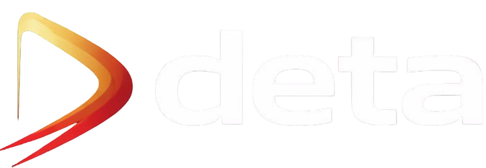

# Premium Movie Discovery Platform  

Deta is the second-generation evolution of **CineVibe**, redesigned with a cleaner UI, richer features and a more premium browsing experience.

Deta is a modern movie discovery platform built to help users explore, search and analyze movies with rich details, clean design and smooth performance.

>>>(Version 2 of CineVibe)

---

## ✨ Features

- 🔍 **Smart Movie Search** — Instantly search any movie with accurate results  
- 🔥 **Trending & Popular Browsing** — Explore trending, popular, top-rated and upcoming movies  
- 🎭 **Detailed Movie Pages** — View cast, genres, runtime, ratings, budget, revenue and overview  
- 🎥 **Trailers & Media** — Watch official trailers directly from the platform  
- 📺 **Streaming Availability** — See where movies are available to watch  
- 🔁 **Similar Recommendations** — Discover related and recommended movies  
- ⚡ **Fast & Smooth UI** — Skeleton loaders, smooth transitions and animations  
- 📱 **Fully Responsive** — Optimized for desktop, tablet and mobile devices  

---

## 🖥️ Screens & Pages

- Home — Featured & discovery section  
- Search — Smart movie search  
- Browse — Trending, Popular, Top Rated, Upcoming  
- Categories — Movies, TV Shows, Romance, Sci-Fi  
- Movie Details — Full cinematic information  
- About — Platform & developer overview  

---

## 🎯 Purpose

Deta is built as a production-grade learning project focused on:

- Clean UI design  
- Scalable product structure  
- Performance optimization  
- Real-world application flow  

The goal is to deliver a **premium movie browsing experience** similar to modern entertainment platforms.

---

## 🚀 Live Demo

🌐 **Deta — Premium Movie Discovery Platform**  
https://deta.netlify.app  

---

## 👨‍💻 Developer

**Sanket Padhyal**  
Full-Stack Developer · Computer Science Student  

- 🌐 Website: https://sanketpadhyal.world  
- 🐙 GitHub: https://github.com/sanketpadhyal  

Deta is independently designed and developed as a portfolio-grade product with strong focus on UI quality, performance and real-world usability.

---

## 📌 Highlights

- Premium dark UI design  
- Advanced movie detail pages  
- Smooth animations & skeleton loading  
- Mobile-first responsive layout  
- Clean component structure  

---

## 📄 License

This project is open for learning and portfolio demonstration purposes.

---

⭐ If you like this project, consider starring the repository!
